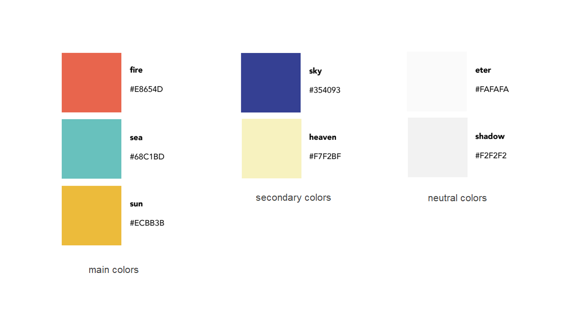

# Branding

We have designed a curated image for the project involving a logo, typography set, color palette and illustrations.

## Logo

The app logo is the one you can see below these lines. We have both a PNG and a SVG version in our [GitHub repo](https://github.com/infusionvlc/ConexionFelina).

## Typography

Our main typefaces used throughout the web application are:

- Raleway: used for all titles and body content.
- Zilla slab: used for special titles that need to bring users attention.

## Color palette

## Covi

Covi is the main character in the project. He's a super heroe that takes care of the city gardens and protects citizens - with his friends help - from plagues.

## Illustrations

There's a bunch of illustrations in our [GitHub repo](https://github.com/infusionvlc/ConexionFelina/public).

