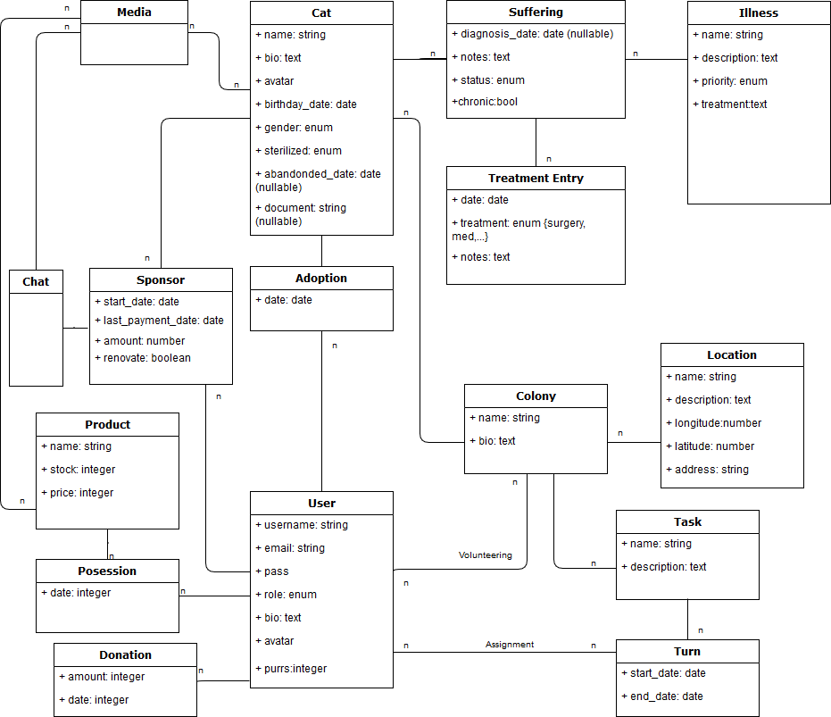

# Database Schema

You can check out the latest schema version on our
[GitHub repo](https://github.com/infusionvlc/ConexionFelina/db/schema.png).

---

## Class Descriptions

## Cat
A Cat object contains all basic information from a real cat.
This cat may be a street cat or even an already adopted cat.

Notes on some of this model's fields:
* **Gender**: either `:male` or `:female` (or unknown)
* **Sterilized**: either `:yes` or `:no` (or unknown)
* **Document**: chip code or official document for the cat's identification

## Colony
A Colony is a collection of [cats](#cat) living in a [location](#location).
Each colony has a list of tasks that volunteers are able to manage and do.
All colonies are independent of the rest and are managed by their volunteers
exclusively.

## Location
A Location is a real emplacement where colonies live. This object allows the
application to store spatial information of colonies distribution.

## User
Users are objects that let the application store information about real users,
such as their adoptions, messages, tasks, etc.

Notes on some of this model's fields:
* **Role**: may be `:basic`, `:volunteer` or `:admin`.
More on [user authorization here](pundit.md).
* **Purrs**: amount of points this user has earned by purchasing
[products](#product) or making [donations](#donation).

## Task
A Task is some work that volunteers need to get done in a colony. It may be
a one-time task or a recurring one. Tasks are [assigned](#assignment) to
[volunteers](#user). All tasks may have one or more [turns](#turns),
that allow volunteers to set up a responsible person for its execution.

## Turn
A Turn has a start date and an end date in which specified [volunteers](#user)
are responsible of the related task.

## Assignment
Contains information about which [volunteers](#user) are responsible for a
[task](#task) during a [turn](#turn).

## Illness
An Illness contains basic information about a condition any [cat](#cat) may have,
along with a description and some treatment guidelines.

## Suffering
A Suffering specifiecs which [illness](#illness) a [cat](#cat) has got.
It also contains a diagnosis date and a dischargement date, along with some notes.
There's also a `chronic` field in case the condition may not be recoverable.

## Treatment Entry
A Treatment Entry logs any action taken to combat a [suffering](#suffering)
from a cat.

## Adoption
An Adoption holds the date a [cat](#cat) was adopted by a [user](#user).

## Sponsor (sponsorship)
Any [user](#user) is able to sponsor a [cat](#cat) by making a monthly donation
to support a [**colony**](#colony). Volunteers will send them back updates and photos about their
sponsored cat's life.

Notes on some of this model's fields:
* **Renovate**: a `boolean` field that stores if a sponsorhip

## Donation
A Donation object holds any amount of money a [user](#user) has donated to the **project**.

## Work in progress...
We're still defining how the store and chats will work...